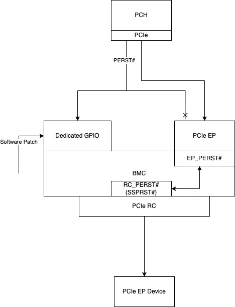

# Execute MCTP RC/EP at the same time
## Board design:

## Software patch
- Pleas apply the patch to your repo.
  - u-boot
        ```
        git am u-boot/*.patch
        ```
  - kernel 5.4:
        ```
        git am linux-5.4/*.patch
        ```
  - kernel 5.15:
        ```
        git am linux-5.15/*.patch
        ``` 
## The Side-effect of this software patch
- When PCH sends the PERST# low to the dedicated GPIO, the driver will execute the below procedure to fix the MCTP over PCIe EP/RC issue and make PCIe RC will disconnect for a while:
  1. Remove the devices on the RC bus
  2. Toggle the RC-PERST to reset the PCIe EP and PCIe RC
  3. Rescan the devices on the RC bus
- The normal procedure of PCIe RC host will toggle the PERST# when the system reboot, but when apply this software patch, besides the following conditions the RC PERST# will always keep high to avoid affect the status of MCTP over PCIe EP.
  1. A dedicated GPIO falling edge from the PCH is sensed.
  2. BMC power off
  - Although our software will not toggle the RC PERST#, but when the system reboot the RC will still execute device rescan.