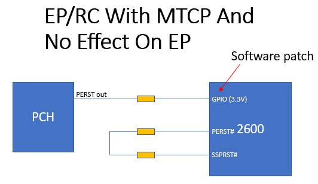

# Execute MCTP RC/EP at the same time
## Board design:

## Software patch
- Pleas apply the patch to your repo.
  - u-boot
        ```
        git am u-boot/*.patch
        ```
  - kernel 5.4:
        ```
        git am linux-5.4/*.patch
        ```
  - kernel 5.15:
        ```
        git am linux-5.15/*.patch
        ``` 
## The detail of this workaround:
The software workaround will use the gpio to connect with the EP PERST. 
When the gpio sense the GPIO falling edge irq the driver will execute the below procedure to fix the EP/RC mctp issue:
1. Remove the devices on the RC bus
2. Toggle the RC-PERST to reset the PCIe EP and PCIe RC
3. Rescan the devices on the RC bus

## Side-effect
- When PCH sends the PERST# low to the GPIO, BCM PCIe RC will disconnect for a while (toggle SSPRST#) and rescan the bus device.
- After BMC reboot, the SSPRST# wouldn't be toggled, but the bus devices will rescan when PCIe driver probe.


